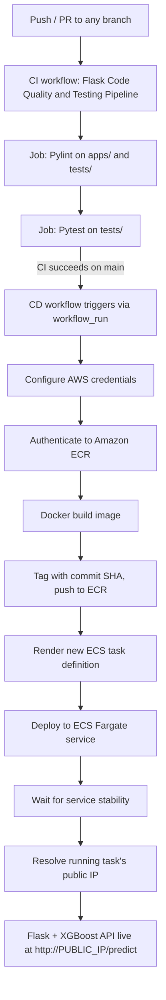

# 🚗 Car Price Prediction — MLOps Pipeline on AWS ECS

An XGBoost inference service that's containerized and continuously deployed to **AWS ECS Fargate** through a two-stage **GitHub Actions** pipeline: lint → test → build → ship.

[](https://github.com/tarini-py/MLOps-AWS-model-deployment/actions/workflows/ci.yaml)
[](https://github.com/tarini-py/MLOps-AWS-model-deployment/actions/workflows/cd.yaml)


> **Scope note:** the model itself is a small baseline, deliberately kept simple. This repo exists to demonstrate the *deployment workflow* — CI, CD, containerization, and shipping to AWS — not to win an accuracy contest. See [The Model](#-the-model) for the honest, short version of that story.

## 📖 Overview

Push to `main` → GitHub Actions lints and tests the code → on success, a second workflow builds a Docker image, pushes it to Amazon ECR, and rolls out a new AWS ECS Fargate task running the updated service. The live API takes a used car's mileage, age, distance driven, and fuel type, and returns a predicted resale price.

## 🏗️ Architecture



The CD workflow triggers on `workflow_run`, keyed to the CI workflow's completion on `main`, and deploys the exact commit (`head_sha`) that CI just validated — never an untested one.

## 🛠️ Tech Stack

| Layer | Tools |
|---|---|
| Language / runtime | Python 3.13 |
| ML | XGBoost, scikit-learn, pandas, NumPy |
| Serving | Flask, Gunicorn |
| Containerization | Docker |
| CI/CD | GitHub Actions (2 workflows) |
| Cloud | Amazon ECR, AWS ECS Fargate, Amazon CloudWatch Logs |
| QA | pytest, pylint |

## 📁 Repository Structure

```
MLOps-AWS-model-deployment/
├── .github/workflows/
│   ├── ci.yaml               # Lint + test on every push/PR
│   └── cd.yaml               # Build, push to ECR, deploy to ECS
├── .aws/
│   └── task-definition.json  # ECS Fargate task spec
├── apps/
│   └── flask_app.py          # Inference API
├── models/
│   └── xgb_car_price_model.pkl
├── data/
│   └── cars24-car-price-cleaned-new.csv
├── notebooks/
│   └── model_experiment.ipynb
├── scripts/
│   ├── config.py             # Shared path constants
│   ├── train_model.py        # Trains + pickles the production model
│   └── predict.py            # Local sanity-check script
├── tests/
│   ├── test_data.py          # Data integrity checks
│   ├── test_model.py         # Model behavior checks
│   └── test_routes.py        # API contract checks
├── Dockerfile
├── requirements.txt
└── requirements-dev.txt
```

## ⚙️ CI/CD Pipeline

### Continuous Integration — `ci.yaml`
Runs on every `push` and `pull_request`, on every branch. Edits to `**.md`, `.gitignore`, `.pylintrc`, `docs/**`, `notebooks/**`, `scripts/**`, or `data/**` are excluded from triggering it, so this README won't kick off a pipeline run.

1. **Lint** — installs `requirements-dev.txt`, runs `pylint apps/ tests/`
2. **Test** — depends on lint passing, runs `pytest -v` across `tests/`

### Continuous Deployment — `cd.yaml`
Triggers via `workflow_run` once CI finishes successfully on `main` (not on every push). Steps:

1. Check out the commit CI just validated
2. Configure AWS credentials (GitHub Actions secrets)
3. Authenticate to Amazon ECR
4. Build the Docker image, tag it with the commit SHA, push to ECR
5. Render a new ECS task definition pointing at the freshly-pushed image
6. Deploy it to the ECS Fargate service, waiting for the service to stabilize
7. Look up the running task's network interface and print its public IP in the workflow log

### Required GitHub Actions configuration
| Name | Type | Purpose |
|---|---|---|
| `AWS_ACCESS_KEY_ID` | Secret | AWS authentication |
| `AWS_SECRET_ACCESS_KEY` | Secret | AWS authentication |
| `AWS_REGION` | Variable | Target region |
| `ECR_REPOSITORY` | Variable | Target ECR repo name |
| `CONTAINER_NAME` | Variable | Container name in the task definition |
| `ECS_SERVICE` | Variable | Target ECS service |
| `ECS_CLUSTER` | Variable | Target ECS cluster |

### AWS Fargate task (`.aws/task-definition.json`)
| Setting | Value |
|---|---|
| Launch type | Fargate |
| CPU / Memory | 1024 (1 vCPU) / 3072 MiB |
| Network mode | `awsvpc` |
| Container port | 80 |
| Log driver | `awslogs` → CloudWatch group `/ecs/task-def` |
| Region | `us-west-2` |
| Execution role | `ecsTaskExecutionRole` |

## 🧠 The Model

An `XGBRegressor` (`n_estimators=200`, `max_depth=6`) predicts resale price (₹ Lakhs) from 6 features — `km_driven`, `mileage`, `age`, and one-hot encoded fuel type — trained on ~19,800 listings adapted from a Cars24 (Indian used-car marketplace) dataset.

Worth knowing if you dig into the notebook: `notebooks/model_experiment.ipynb` reports a test MAPE of ~22.8% on an 80/20 split with `learning_rate=0.3`, but the production script (`scripts/train_model.py`) that actually produced the shipped `.pkl` uses `learning_rate=0.2` and fits on the full dataset with no held-out split. So treat 22.8% as a rough ballpark, not a validated number for the exact deployed artifact. That gap is fine here — swapping in a better-tuned model wouldn't change anything else in this repo, which is the point: the pipeline above is agnostic to what's inside the `.pkl`.

## 🔌 API Reference

**`GET /`** — health check → `"Hello, welcome"`

**`GET /<username>`** — demo route → `"Hello <username>, welcome"`

**`GET /predict`** — returns the expected input schema:
```json
{
  "Instruction": "Send a POST request using this exact JSON format",
  "Note": "fuel_type can be Petrol/Diesel/Electric",
  "required_format": {
    "km_driven": 45000,
    "mileage": 18,
    "age": 5,
    "fuel_type": "Petrol"
  }
}
```

**`POST /predict`** — runs inference:
```bash
curl -X POST http://<PUBLIC_IP>/predict \
  -H "Content-Type: application/json" \
  -d '{"km_driven": 45000, "mileage": 18, "age": 5, "fuel_type": "Petrol"}'
```
```json
{ "predicted_price": 7.646241664886475 }
```
*(Verified against `tests/test_routes.py`. Since each deploy spins up a fresh Fargate task, check the latest CD run's log for the current public IP rather than relying on a fixed address here.)*

## 🚀 Getting Started

### Prerequisites
- Python 3.13+
- Docker (optional, for containerized runs)

### Local setup
```bash
git clone https://github.com/tarini-py/MLOps-AWS-model-deployment.git
cd MLOps-AWS-model-deployment

python -m venv venv
source venv/bin/activate  # Windows: venv\Scripts\activate

pip install -r requirements.txt
python apps/flask_app.py
```
The app runs at `http://localhost:5000` (Flask's dev server, per `flask_app.py`).

### Docker
```bash
docker build -t car-price-predict-app .
docker run -p 8080:80 car-price-predict-app
```
The app runs at `http://localhost:8080`. The container listens on port 80 internally (`EXPOSE 80`, Gunicorn bound to `0.0.0.0:80`) — map it to whichever host port you like.

Scale workers vertically at runtime:
```bash
docker run -p 8080:80 -e WORKERS=5 car-price-predict-app
```

## 🧪 Testing

14 tests across 3 files: data integrity, model behavior, and API contracts.
```bash
pip install -r requirements-dev.txt
PYTHONPATH=. pytest -v
PYTHONPATH=. pylint apps/ tests/
```

## 🔭 Future Improvements

- Put an Application Load Balancer in front of the ECS service for a stable DNS name — right now every deploy assigns the task a new public IP
- Move from long-lived AWS access keys (GitHub secrets) to OIDC-based role assumption for the Actions runner
- Add input validation on `/predict` — a missing field or unrecognized `fuel_type` currently raises an unhandled exception instead of a clean 4xx
- Manage the ECS cluster, service, and ECR repo as code (Terraform/CDK) — currently only the task definition is version-controlled

## 👤 Author

[tarini-py](https://github.com/tarini-py)
